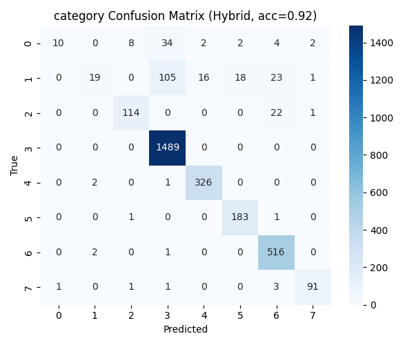

# 📊 Ad Insight — AI Advertisement Effectiveness Analyzer

Ad Insight is an **AI-powered system** that analyzes advertisement data (TV ads, social media ads, product promos) to **measure effectiveness** in terms of engagement, mood, and recall potential.  
This implementation uses a **Hybrid Artificial Immune System (AIS) + Clonal Selection Algorithm (CSA)** pipeline for feature selection and hyperparameter optimization.

---

## 🚀 Features

- **Data Preprocessing**  
  Handles categorical + numeric features, fills missing values, aligns `train.csv` and `test.csv`.

- **Hybrid Training**  
  - **AIS** → selects best feature subset.  
  - **CSA** → optimizes RandomForest hyperparameters.  
  - Trains hybrid classifiers for all detected target columns (e.g., `category`, `engagement`, etc.).

- **Evaluation**  
  - Accuracy, precision, recall, F1 score.  
  - Confusion matrix heatmaps.  
  - Accuracy bar chart.

- **Predictions**  
  - Runs inference on `test.csv`.  
  - Saves results in `predictions.csv`.  

- **Artifacts**  
  - `processed_ads.h5` → processed data.  
  - `*_hybrid_model.pkl` → trained models.  
  - `ads_report.json` → results + metrics + visuals.  
  - `build_metadata.yaml` → build metadata.  
  - `predictions.csv` → test data with predictions.  
  - `visuals/` → saved charts (accuracy bar, heatmaps).

- **Visualization**  
  - Accuracy bar chart & confusion matrices (saved + optional onscreen display).  

---

## 📂 Project Structure

AdInsight/
│
├── archive/
│ ├── train.csv
│ ├── test.csv
│
├── ad_insight_hybrid_pipeline.py # Main pipeline
├── ad_insight_visuals_show.py # Script to show graphs onscreen
│
├── processed_ads.h5 # Processed dataset
├── ads_report.json # Effectiveness report
├── build_metadata.yaml # Build metadata
├── predictions.csv # Test set predictions
│
├── visuals/
│ ├── accuracy_bar.png
│ ├── <target>_heatmap.png
│
└── *_hybrid_model.pkl # Saved models

yaml
Copy code

---

## ⚙️ Installation

1. Clone or download the project.  
2. Install Python 3.11 (recommended).  
3. Install dependencies:

```bash
pip install -r requirements.txt
Minimal requirements:

txt
Copy code
pandas
numpy
scikit-learn
matplotlib
seaborn
pyyaml
h5py
joblib
🖥️ Usage
1. Train & Predict
Run the full pipeline:

bash
Copy code
python ad_insight_hybrid_pipeline.py
This will:

Train hybrid models (AIS + CSA).

Save models & metrics.

Generate visuals.

Save predictions on test.csv.

2. View Results
Open ads_report.json for metrics + paths to visuals.

Check visuals/ folder for charts.

Inspect predictions.csv for test predictions.

3. Show Graphs Onscreen
Run:

bash
Copy code
python ad_insight_visuals_show.py
This will display confusion matrices + accuracy bar chart onscreen.

📊 Example Outputs
accuracy_bar.png → model accuracies

category_heatmap.png → confusion matrix for category classifier

predictions.csv → predictions like:

feature1	feature2	...	category_pred
12	34	...	3
56	78	...	7

📈 Business Applications
Marketing teams can pre-test ad effectiveness before release.

Agencies can compare ad campaigns quantitatively.

Social media platforms can auto-recommend impactful ads.

Researchers can study ad design vs psychology links.

📌 Notes
Pipeline auto-detects target columns (categorical with <20 unique values).

Train/test must share similar feature sets; missing columns in test are auto-filled.

Models are RandomForest with AIS + CSA hybrid optimization.

